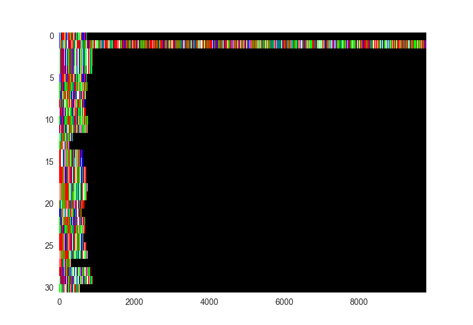
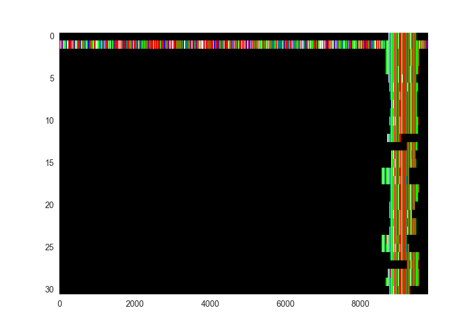
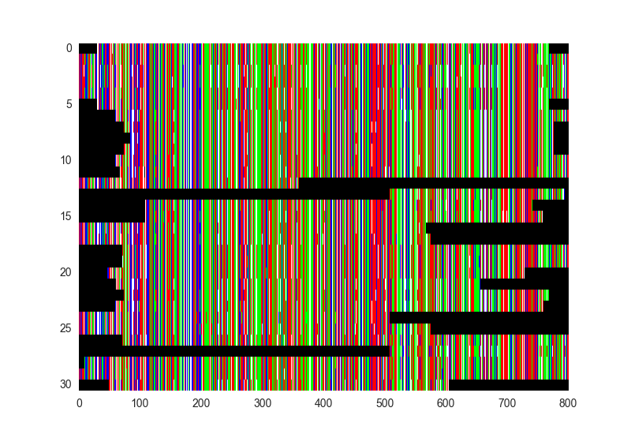
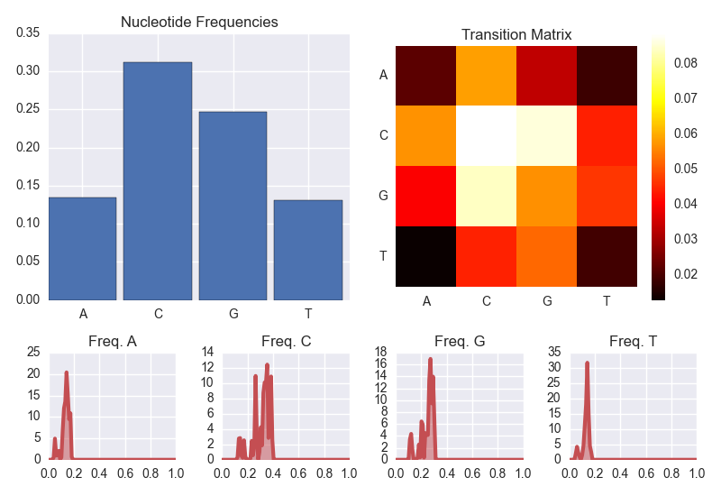

GenePy
======

Pronounced *génépi*, like the [French alpine spirit](http://en.wikipedia.org/wiki/G%C3%A9n%C3%A9pi).

**GenePy** is a Python package that acts as an interface between BioPython,[<sup>1</sup>](#references) ClustalO,[<sup>2</sup>](#references) and PhyML,[<sup>3</sup>](#references) for manipulating nucleotide sequences, all in a neat data structure. 

Dependencies :
--------------

- [The Scipy stack](http://scipy.org) ( NumPy, Matplotlib )
- [BioPython](http://biopython.org "BioPython")
- [Clustal Omega](http://www.clustal.org/omega)
- [PhyML](https://code.google.com/p/phyml)

Optional :

- [seaborn](https://github.com/mwaskom/seaborn)
- [scikit-learn](http://scikit-learn.org)


Example Usage
=============

We have a file in [FASTA](http://en.wikipedia.org/wiki/FASTA_format) format from [GenBank](http://www.ncbi.nlm.nih.gov/genbank),[<sup>4</sup>](#references) containing 31 sequences from the [Rubella virus](http://en.wikipedia.org/wiki/Rubella_virus) genome. Let's import the sequences and display them.

```python
import genepy

mysequences = genepy.seqarray("rubellaE1.fasta")

mysequences.show()
```




They're not aligned, and one is much longer than the others. Let's dig a little deeper by printing a summary of the sequence array.

```python
print mysequences
```

This returns :

	GenePy sequence set :
	-- 31 sequences
	-- Mean length : 987.6 (min 286, max 9777)
	-- C+G content : 0.677
	-- From file : rubellaE1.fasta

We have a wide range of sequence lengths. Most are small, but based on the visualisation, we have one that's probably a full genome. Our next step will be to align them and cut away parts of sequences that we don't have enough duplicates for.

```python
mysequences.align()
```python

We've aligned the sequences with the default **GenePy** arguments to Clustal Omega. A new file was written to disk : `rubellaE1_aligned_genepy.phy`. This file, in PHYLIP file format, acts as a checkpoint for your future work. Let's visualise the result.

```python
	mysequences.show()
```



Most of the sequences belong to the E1 glycoprotein gene. Let's trim excess from the left and right, so we're comparing like with like.

```python
mysequences.trimalignment(left = 8700, right = 9500)
mysequences.show()
```



Our sequence array is now shorter in terms of nucleotides per sequence. We're considering the same parts of the genome for each sequence, so we can start to look at the nucleotide statistics.

	mysequences.stats()



This shows us the average nucleotide content, distributions of nucleotide frequencies across difference sequences, and the frequencies of two-step nucleotide transitions. We see that there's a very high cytosine and guanine content, and that cytosines tend to be followed by more cytosines, although CpG and GpC are also common. The high C+G content is an interesting feature of the rubella virus, which is somewhat of an outlier in this respect amongst ssRNA viruses.

Let's construct a phylogenetic tree from this alignment, once again using


Sequence Arrays
===============


The core data structure in **GenePy** is the *sequence array*, or `seqarray` object. It acts as a container for a list of sequences, and has member functions for sequence alignment and display, for trimming sequences, for showing sequence array statistics, and for constructing phylogenetic trees.


Heavy-Lifting Packages
----------------------

**GenePy** makes system calls to ClustalO and PhyML. Some of the description of these packages, their usage, and their command-line arguments, are taken from their respective documentation, such as the ClustalO [README](http://www.clustal.org/omega/README) file and the PhyML [Manual](http://www.atgc-montpellier.fr/download/papers/phyml_manual_2012.pdf).


Function Members
----------------

**Visual representation of array sequence**

```python
	.show()
```

A visual representation of the sequences in the `seqarray`. Each nucleotide has its own colour; black is an empty site or an unknown nucleotide.

***


**Sequence array statistics**

```python
.stats()
```

Displays :
- the nucleotide content
- the distributions of nucleotide frequencies over each sequence as estimated kernel densities ( if scikit-learn is installed ) or as a histogram ( if scikit-learn is not found )
- the two-step transition matrix between nucleotides ( frequency of having an A going to a C, etc. )

***


**Align sequences**

```python
.align(force = True, iter = False, full = False, full_iter = False, auto = True, threads = False)
```

Align the sequences in the `seqarray` by calling Clustal Omega. Sequences are clustered into a guide tree, which is used to guide a progressive alignment.

Arguments are command-line arguments to ClustalO.

- `force` : overwrite the filename, if the output alignment file exists. The filename defaults to the filename of the sequence you passed on creation of the sequence array, without the extension, and with `_aligned_genepy.phy` appended. 
- `iter` : the number of guide tree iterations. By default, no iteration of the guide tree is done. Iteration generates an alignment from the guide tree, then uses this alignment to generate a new guide tree. This iterated alignment procedure could give rise to better alignments at a linear cost in alignment time.
- `full` : use the full distance matrix for guide-tree calculation; default uses the fast clustering algorithm, mBed[<sup>5</sup>](#references) instead of constructing a full distance matrix. mBed calculates a reduced set of pairwise distances.
- `full_iter` : use the full distance matrix for guide-tree calculation during guide-tree iteration only.
- `auto` : sets options automatically, selecting options for both speed and accuracy according to the number of sequences. This could overwrite some of your other arguments. `auto = False` is automatically set if any of `iter`, `full`, or `full_iter` are set to `True`.
- `threads` : the number of threads to use for the parallelised part of the alignment. By default, ClustalO will use as many cores as are available; `threads` can be used to limit core usage.


***

**Trim an alignment**

```python
.trimalignment(array = None, left = None, right = None)
```

Remove `left` nucleotides from the beginning and `right` nucleotides from the end of the sequence array. This is useful when you have aligned a number of sequences of different lengths, and want to consider only a full array, where each sequence has the same length. Currently, this method does not automatically find a reasonable truncation zone. As such, `array` must be `None`, and `left` and `right` must be indices. Will probably get rid of the `array` parameter later and just have `left` and `right` as optional arguments.


***

**Construct a phylogenetic tree**

```python
.phylotree(nucleotide_frequency = "empirical", bootstrap = -4, search_algorithm = "BEST")
```

Construct a phylogenetic tree by calling PhyML.

- `nucleotide_frequency` : equilibrium nucleotide frequencies. Can be `empirical` or `max_likelihood`. Will make this a better argument setup later.
- `bootstrap` : bootstrap analysis of internal branch support. Integers &gt 0 set the number of bootstrap replicates; `bootstrap = 0` turns off bootstrapping. In addition, values of `-1` run approximate likelihood ratio tests returning aLRT statistics; `-2` returns Chi<sup>2</sup> based parametric branch supports, and `-4` gives SH-like branch supports only.
- `search_algorithm` : algorithm for tree searching. Options are `NNI` for nearest neighbour interchange, `SPR` for subtree pruning and regrafting, and `BEST` for the best of NNI and SPR methods.


	


Variable Members
------------

- `.seq` - a Python list of BioPython sequence objects ( from `Bio.Seq.Seq` )
- `.len` - the number of sequences in the sequence array
- `.seq_len` - a Python list of sequence lengths


Current State
=============

At the moment, **GenePy** is in pre-alpha. Much of the documentation is missing, and there's not yet much functionality. I'll be adding functionality, mostly as I require it, but please feel free to send a pull request my way if you'd like to contribute.


Installation
============

Soon, **GenePy** will be installable using *pip* or *easy_install*. Until then, it's still built as a full Python package, so if you're in a directory where you can see the `genepy/` folder ( but not inside it ), you can just call

```python
import genepy
```

You can add this directory to your Python path temporarily. I'm hoping to have **GenePy** on the PyPI at some point in the future for easy installation.


References
==========

<a name="references"></a>

1. Cock, PJ *et al.*, *Biopython: freely available Python tools for computational molecular biology and bioinformatics*. [Bioinformatics **25**, 1422](http://bioinformatics.oxfordjournals.org/content/25/11/1422.long), 2009
2. Sievers, F *et al.*, *Fast, scalable generation of high‐quality protein multiple sequence alignments using Clustal Omega*. [Molecular Systems Biology **7**, 539](http://msb.embopress.org/content/7/1/539), 2011
3. Guindon, S *et al.*, *New Algorithms and Methods to Estimate Maximum-Likelihood Phylogenies: Assessing the Performance of PhyML 3.0.* [Systematic Biology **59**, 307](http://sysbio.oxfordjournals.org/content/59/3/307), 2010
4. Benson, DA *et al.*, *Genbank*. [Nucleic Acid Research **41 (D1)**, D36](http://nar.oxfordjournals.org/content/41/D1/D36.long), 2013
5. Blackshields, G *et al.*, *Sequence embedding for fast construction of guide trees for multiple sequence alignment*. [Algorithms for Molecular Biology **5**, 21](http://www.almob.org/content/5/1/21), 2010