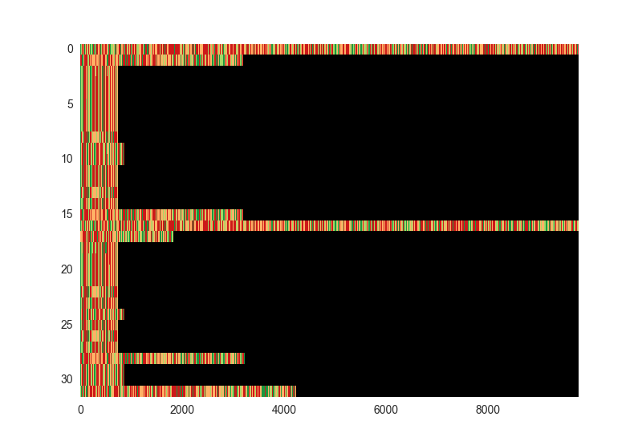
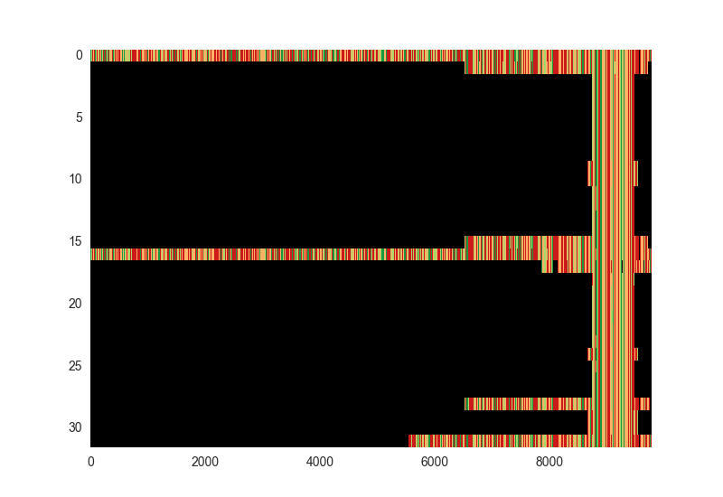
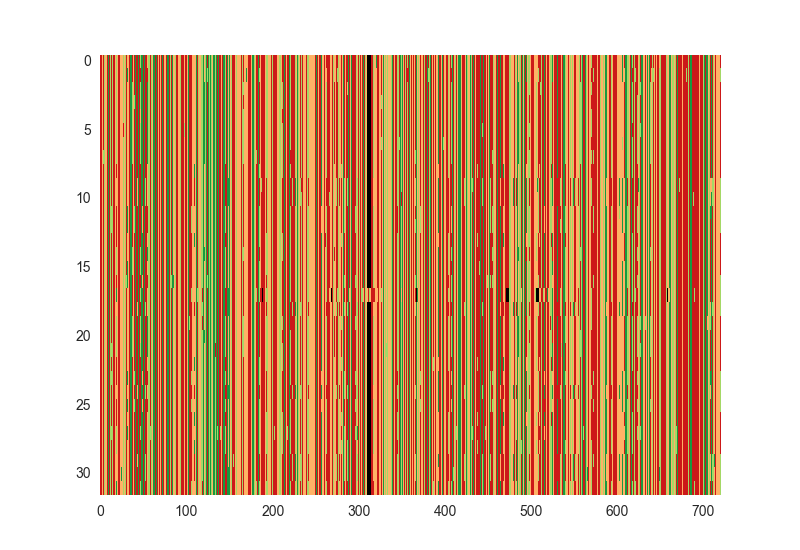
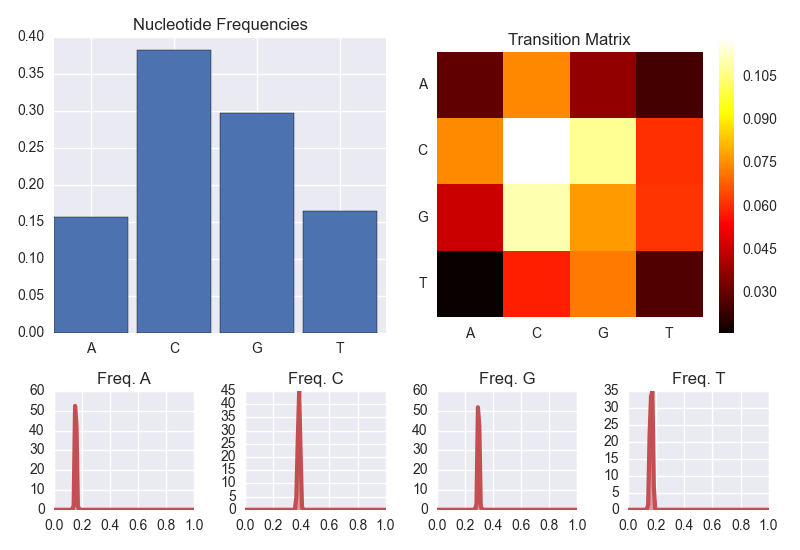

GenePy
======

Pronounced *génépi*, like the [French alpine spirit](http://en.wikipedia.org/wiki/G%C3%A9n%C3%A9pi).

**GenePy** is a Python package that acts as an interface between BioPython,[<sup>1</sup>](#references) ClustalO,[<sup>2</sup>](#references) and PhyML,[<sup>3</sup>](#references) for manipulating nucleotide sequences, all in a neat data structure. 

Dependencies :
--------------

- [The Scipy stack](http://scipy.org) ( NumPy, Matplotlib )
- [BioPython](http://biopython.org "BioPython")
- [Clustal Omega](http://www.clustal.org/omega)
- [PhyML](https://code.google.com/p/phyml)

Optional :

- [seaborn](https://github.com/mwaskom/seaborn)
- [scikit-learn](http://scikit-learn.org)


Example Usage
=============

We have a file in [FASTA](http://en.wikipedia.org/wiki/FASTA_format) format from [GenBank](http://www.ncbi.nlm.nih.gov/genbank),[<sup>4</sup>](#references) containing 31 sequences from the [Rubella virus](http://en.wikipedia.org/wiki/Rubella_virus) genome. Let's import the sequences and display them.

```python
import genepy

mysequences = genepy.seqarray("tutorial/rubella_samples.fasta")

mysequences.show()
```




Different colours represent different nucleotides. They're not aligned, and one is much longer 
than the 
others. Let's dig a little deeper by printing a summary of the sequence array.

```python
mysequences
```

This returns :

	GenePy sequence set (genepy.seqarray) :
	-- 32 sequences
	-- Mean length : 1697.2 (min 739, max 9762)

We have a wide range of sequence lengths. Most are small, but based on the visualisation, we have two that are probably a full genome. Our next step will be to align them and cut away parts of sequences that we don't have enough duplicates for.

```python
mysequences.align()
```

We've aligned the sequences with the default **GenePy** arguments to Clustal Omega. A new file 
was written to disk : `rubella_samples_aligned_genepy.phy`. This file, in PHYLIP file format, 
acts as a checkpoint for your future work. Let's visualise the result.

```python
mysequences.show()
```



Most of the sequences belong to the E1 glycoprotein gene. Let's trim excess from the left and right, so we're comparing like with like.

```python
mysequences.trimalignment(left = 8750, right = 9470)

mysequences.show()
```



Our sequence array is now shorter in terms of nucleotides per sequence. We're considering the same parts of the genome for each sequence, so we can start to look at the nucleotide statistics.

```python
mysequences.stats()
```



This shows us the average nucleotide content, distributions of nucleotide frequencies across difference sequences, and the frequencies of two-step nucleotide transitions. We see that there's a very high cytosine and guanine content, and that cytosines tend to be followed by more cytosines, although CpG and GpC are also common. The high C+G content is an interesting feature of the rubella virus, which is somewhat of an outlier in this respect amongst ssRNA viruses.

Let's construct a phylogenetic tree from this alignment, once again using ... TO BE CONTINUED


Sequence Arrays
===============


The core data structure in **GenePy** is the *sequence array*, or `seqarray` object. It acts as a container for a list of sequences, and has member functions for sequence alignment and display, for trimming sequences, for showing sequence array statistics, and for constructing phylogenetic trees.


Workhorse Packages
------------------

**GenePy** makes system calls to ClustalO and PhyML, which do the heavy lifting. Some of the description of these packages, their usage, and their command-line arguments which follows is taken from their respective documentation, such as the ClustalO [README](http://www.clustal.org/omega/README) file and the PhyML [Manual](http://www.atgc-montpellier.fr/download/papers/phyml_manual_2012.pdf).


Sequence Array Methods
----------------------

**Visual representation of array sequence**

```python
.show()
```

A visual representation of the sequences in the `seqarray`. Each nucleotide has its own colour; black is an empty site or an unknown nucleotide.

***


**Sequence array statistics**

```python
.stats()
```

Displays :
- the nucleotide content
- the distributions of nucleotide frequencies over each sequence as estimated kernel densities ( if scikit-learn is installed ) or as a histogram ( if scikit-learn is not found )
- the two-step transition matrix between nucleotides ( frequency of having an A going to a C, etc. )

***


**Align sequences**

```python
.align(force = True, it = False, full = False, full_iter = False, auto = True, threads = False)
```

Align the sequences in the `seqarray` by calling Clustal Omega. Sequences are clustered into a guide tree, which is used to guide a progressive alignment.

Arguments are command-line arguments to ClustalO.

- `force` : overwrite the filename, if the output alignment file exists. The filename defaults to the filename of the sequence you passed on creation of the sequence array, without the extension, and with `_aligned_genepy.phy` appended. 
- `it` : the integer number of guide tree iterations. By default, no iteration of the guide tree is done. Iteration generates an alignment from the guide tree, then uses this alignment to generate a new guide tree. This iterated alignment procedure could give rise to better alignments at a linear cost in alignment time. Set to `False` for no iteration.
- `full` : use the full distance matrix for guide-tree calculation; default uses the fast clustering algorithm, mBed[<sup>5</sup>](#references) instead of constructing a full distance matrix. mBed calculates a reduced set of pairwise distances. Use `True` to iterate.
- `full_iter` : use the full distance matrix for guide-tree calculation during guide-tree iteration only.
- `auto` : sets options automatically, selecting options for both speed and accuracy according to the number of sequences. This could overwrite some of your other arguments. `auto = False` is automatically set if any of `iter`, `full`, or `full_iter` are set to `True`.
- `threads` : the number of threads to use for the parallelised part of the alignment. By default, ClustalO will use as many cores as are available; `threads` can be used to limit core usage.


***

**Trim an alignment**

```python
.trimalignment(array = None, left = None, right = None)
```

Remove `left` nucleotides from the beginning and `right` nucleotides from the end of the sequence array. This is useful when you have aligned a number of sequences of different lengths, and want to consider only a full array, where each sequence has the same length. Currently, this method does not automatically find a reasonable truncation zone. As such, `array` must be `None`, and `left` and `right` must be indices. Will probably get rid of the `array` parameter later and just have `left` and `right` as optional arguments.


***

**Construct a phylogenetic tree**

```python
.phylotree(nucleotide_frequency = "empirical", bootstrap = -4, search_algorithm = "BEST")
```

Construct a phylogenetic tree by calling PhyML.

- `nucleotide_frequency` : equilibrium nucleotide frequencies. Can be `empirical` or `max_likelihood`. Will make this a better argument setup later.
- `bootstrap` : bootstrap analysis of internal branch support. Integers &gt 0 set the number of bootstrap replicates; `bootstrap = 0` turns off bootstrapping. In addition, values of `-1` run approximate likelihood ratio tests returning aLRT statistics; `-2` returns Chi<sup>2</sup> based parametric branch supports, and `-4` gives SH-like branch supports only.
- `search_algorithm` : algorithm for tree searching. Options are `NNI` for nearest neighbour interchange, `SPR` for subtree pruning and regrafting, and `BEST` for the best of NNI and SPR methods.


	


***

**Drop sequences with low nucleotide count**

```python
.dropempties(fraction = 0.5)
```

Removes any sequences which have lower nucleotide fraction than specified. This is useful after aligning sequences that may contain different parts of the genome, and trimming to an area of interest; calling `seqarray.dropempties()` will the remove any sequences that don't contain information about this part of the genome.

- `fraction` : the fraction of known nucleotides per site in the sequence, below which it is removed from the sequence array.


Sequencey Array Member Variables
--------------------------------

- `.seq` - a Python list of BioPython sequence objects ( from `Bio.Seq.Seq` )
- `.len` - the number of sequences in the sequence array


Sequence Array Iteration
------------------------

Sequence array objects are iterables. The elements are [BioPython `Bio.Seq`](http://biopython.org/wiki/Seq) objects. For example :

```python
for record in mysequences :
	print "%s \n%s \n" % (record.id, record.seq)
```

may return :

```
gi|538511347|gb|KF593861.1| 
CACCGGGCCCCTTGGGGCTGAAATTCAAGACCGTCCGCCCGGTTGCCCTGCCACGCGCGTTCGCACCACCCCGCAATGCGCGTGTGACCGGGTGTTACCAGTGCGGCACCCCCGCGCTGGTGGAAGGCCTTGCCCCCGGGGGGGGCAATTGCCATCTCACTGTCAATGGCGAGGATGTCGGCGCCTTCCCCCCTGGGAAGTTCGTCACCGCCGCCCTCCTCAACACCCCCCCGCCCTACCAAGTCAGCTGCGGGGGCGAGAGCGATCGCGCGAGCGCGCGGGTCATCGACCCCGCCGCGCAATCGTTTACCGG

gi|513136723|gb|JX546593.1| 
TCTCCGTAGCCGGCGTGTCGTGCAATGTTACCACTGAACACCCGTTCTGCAACACGCCGCACGGACAACTCGAGGTCCAGGTCCCGCCCGACCCTGGGGACCTGGTTGAGTACATTATGAATTACACCGGCAATCAACAGTCCCGGTGGGGCCTCGGGAGCCCGAACTGTCATGGCCCCGATTGGGCCTCCCCGGTTTGCCAACGCCATTCCCCTGACTGCTCGCGGCTTGTGGGGGCCACGCCAGAGCGTCCCCGGCTGCGCCTGGTTGACGCCGATGACCCCCTGCTGCGCACCGCCCCTGGGCCCGGCGAGGTGTGGGTCACGCCTGTCATAGGCTCTCAGGCGCGCAAGTGCGGACTCCACATACGCGCTGGACCGTACGGCCATGCTACCGTCGAAATGCCCGAGTGGATCCACGCCCACACCACCAGCGACCCTTGGCACCCACCGGGCCCCTTGGGGCTGAAGTTTAAGACGGTTCGCCCGGTGGTCCTGCCACGCGCGTTGGCGCCGCCCCGCAATGTGCGTGTGACCGGGTGCTACCAGTGCGGCACGCCCGCGCTGGTGGAAGGCCTTGCCCCCGGGGGAGGGAA
```


Current State
=============

At the moment, **GenePy** is in pre-alpha. Much of the documentation is missing, and there's not yet much functionality. I'll be adding functionality, mostly as I require it, but please feel free to send a pull request my way if you'd like to contribute.


Installation
============

GenePy is available on the Python Package Index (PyPI). As such, you can install it using

```
pip install genepy
```


References
==========

<a name="references"></a>

1. Cock, PJ *et al.*, *Biopython: freely available Python tools for computational molecular biology and bioinformatics*. [Bioinformatics **25**, 1422](http://bioinformatics.oxfordjournals.org/content/25/11/1422.long), 2009
2. Sievers, F *et al.*, *Fast, scalable generation of high‐quality protein multiple sequence alignments using Clustal Omega*. [Molecular Systems Biology **7**, 539](http://msb.embopress.org/content/7/1/539), 2011
3. Guindon, S *et al.*, *New Algorithms and Methods to Estimate Maximum-Likelihood Phylogenies: Assessing the Performance of PhyML 3.0.* [Systematic Biology **59**, 307](http://sysbio.oxfordjournals.org/content/59/3/307), 2010
4. Benson, DA *et al.*, *Genbank*. [Nucleic Acid Research **41 (D1)**, D36](http://nar.oxfordjournals.org/content/41/D1/D36.long), 2013
5. Blackshields, G *et al.*, *Sequence embedding for fast construction of guide trees for multiple sequence alignment*. [Algorithms for Molecular Biology **5**, 21](http://www.almob.org/content/5/1/21), 2010
